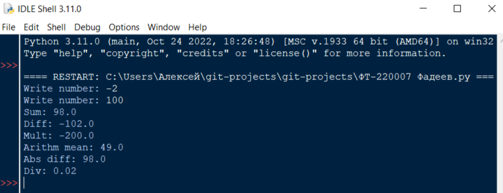
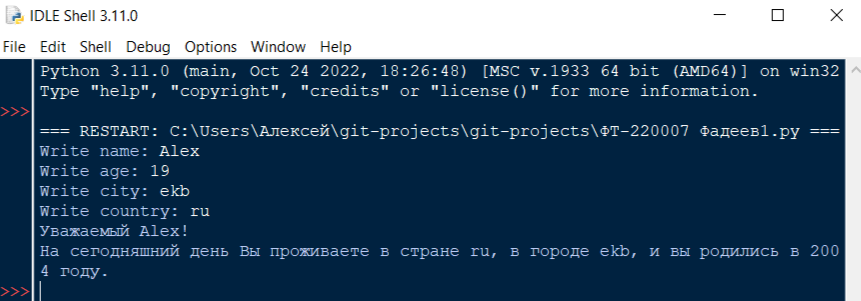

# Лабораторная работа №1    
**Исполнитель:** Фадеев Алексей, группа ФТ-220007    
**Описание программы**    
***Задание 1:***
    
*Написать на любом языке программу:*    
    
Пользователь должен ввести 2 числа (например - a, b)    
Найти и показать на экран:    
Сумму этих чисел    
Разность этих чисел    
Произведение этих чисел    
Среднее арифметическое этих чисел    
Разность максимального и минимального по модулю = max(|a|,|b|) - min(|a|,|b|)    
Усложненный вариант: При решении не использовать библиотечные функции модуля, максимума и минимума.    
    
***Задание 2:***    
    
*Написать на любом языке программу:*    
    
Спросите у пользователя имя, возраст, место проживания и страну проживания.    
Оформите вывод таким образом:    
"Уважаемый <ИМЯ>!    
На сегодняшний день Вы проживаете в стране <СТРАНА>, в городе <МЕСТО_ПРОЖИВАНИЯ>, и вы родились в <ТАКОМ_ТО_ГОДУ>".    
    
**Дополнительная информация**    
*Задание 1* выполнено в файле "ФТ-220007 Фадеев.py", *Задание 2* выполнено в файле "ФТ-2200071.py". Оба файла можно открыть в любой IDE, поддерживающей язык программирования Python.    Сами программы запускаются в консоли, взаимодействие с ними производится также через консоль.    
    
**Тесты**    
Программы тестировались Python IDLE.   
*Тест программы для задания 1*    
    
    
*Тест программы для задания 2*    

